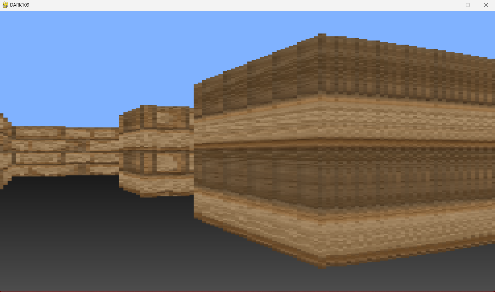

# Python-Raycasting

Raycasting is a computational technique used in various fields such as computer graphics, gaming, and simulation to determine the visibility and distance of objects in a 3D environment from a specific viewpoint. 

# Install 

- pip install numba

- pip install numpy

- pip install pygame

# ScreenShoot

 
